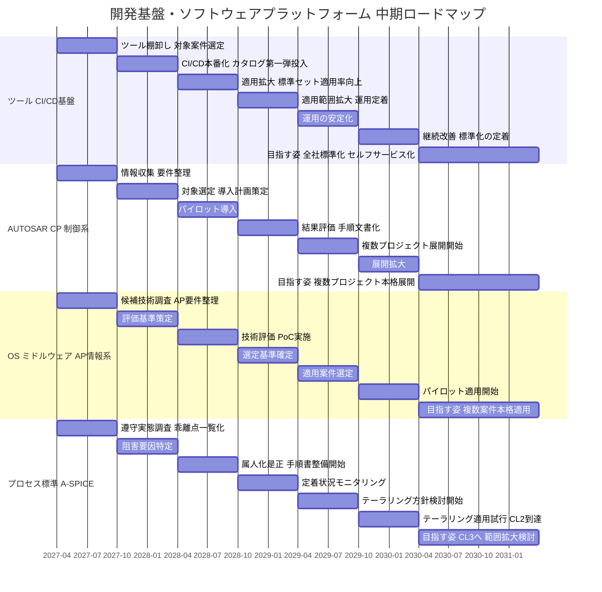

# 開発基盤・ソフトウェアプラットフォーム 中期ロードマップ

`roadmap.md`（AUTOSAR移行・SDV化の全体ロードマップ）のうち、Phase 1〜2にまたがる開発基盤整備部分を、より具体的なステップ・マイルストーンに落とし込んだもの。対象期間は2027年度〜2030年度。

---

## 対象範囲

以下4テーマを並行で進める。

- **ツール・CI/CD基盤**：開発ツールと自動チェックの仕組み
- **AUTOSAR CP**：制御系ソフトウェアの業界標準規格（`toolchain.md`・`autosar-modules.md`・`migration-plan.md`と対応）
- **OS・ミドルウェア＋AUTOSAR AP**：情報系ソフトウェアの基盤（`adaptive-autosar.md`と対応）
- **プロセス標準（A-SPICE）**：開発品質の評価基準（`dev-process-standards.md`と対応）

優先順位（ツール・CI/CD基盤 > AUTOSAR CP > OS・ミドルウェア > プロセス標準）は、着手する順番ではなく、どこまで深く取り組むかの差として反映する。4テーマとも同時に着手する。開始は2027年度（2027年4月）を起点とする。

---

## 中期経営計画（LANDCROS 2028）との関連

中期経営計画LANDCROS 2028（FY26〜FY28、2030年業界トップスリーを見据えた計画）では、以下の方針が示されている。

- 研究開発投資を3年累計1,039億円（前中計実績）から1,300億円に拡大する
- 自律型オペレーション、遠隔操作支援・半自動化、電動化建機、遠隔監視・予防保全、データに基づく開発、リアルタイム・デジタルツイン、対話型AI活用など、データ・AI活用による製品・サービスの差別化を重点施策の一つに位置づけている
- 調整後営業利益額をFY25実績1,330億円からFY28目標2,000億円へ、ROICを6.7%から9%へ引き上げる収益性目標を設定している
- 2027年4月にランドクロス株式会社へ社名変更を予定している
- 代理店・パートナー企業とともに事業を拡大する「オープン戦略」を重点施策の一つに位置づけている

本ロードマップが対象とする開発ツール・CI/CD基盤、AUTOSAR、OS・ミドルウェア、プロセス標準は、これらのデータ・AI活用施策や研究開発投資を効率的に実行するための開発基盤整備という位置づけになる。ロードマップの開始年度（2027年度）は、社名変更の時期と重なる。OS・ミドルウェア＋AP（ROS2等）については、業界内で広く使われる技術を採用することで、オープン戦略が想定するパートナー企業との接続点になる可能性がある。

**研究開発投資との対応関係（技術的な依存関係からの推測）**

LANDCROS 2028が挙げる研究開発テーマと、本ロードマップの4テーマとの技術的な関連を、公開情報から読み取れる範囲で整理する。個別プロジェクトとの対応関係は確認できていないため、技術的な依存関係からの推測であることに留意する。

| 研究開発テーマ | 関連するトラック | 関連の根拠（推測） |
|---|---|---|
| 自律型オペレーション | OS・ミドルウェア＋AP | 自律化領域ではROS2が業界的に広く使われており、AP機能もこの領域のコミュニティと重なる |
| 遠隔操作支援・半自動化 | OS・ミドルウェア＋AP、AUTOSAR CP | 遠隔からの操作コマンドを扱う通信・データ連携基盤と、指令を受けて制御する側の精度・標準化の両方が関わる |
| 電動化建機 | AUTOSAR CP | バッテリー・モーター制御ECUでの標準規格採用が、自動車業界のEVシフトと同じ動機で進んでいる |
| 遠隔監視・予防保全 | ツール・CI/CD基盤、OS・ミドルウェア＋AP | 不具合・稼働データの計測基盤（ベースライン計測）と、データ収集・連携の基盤の両方が前提になる |
| データに基づく開発 | ツール・CI/CD基盤、プロセス標準（A-SPICE） | 不具合計測のルールで整備するデータと、A-SPICEのプロセス管理データが、データドリブンな開発判断の土台になる |
| リアルタイム・デジタルツイン | OS・ミドルウェア＋AP | リアルタイム処理基盤としてのHPC・OS選定が前提になる |
| 対話型AI活用 | ツール・CI/CD基盤、OS・ミドルウェア＋AP | 開発生産性向上への適用と、AI推論基盤としてのHPC活用の両方が考えられる |

---

## SDVとの関係

SDV（Software Defined Vehicle）は、自動車業界での一般的な定義に沿うと、以下の要素で構成される。

- ソフトウェアの更新サイクルをハードウェアの生産サイクルから切り離す仕組み（OTA＝Over The Air更新）
- 機能をサービス単位に分離し、個別に追加・更新できる構造（サービス指向アーキテクチャ）
- E/Eアーキテクチャの集中型・ドメイン型への再編
- 継続的なソフトウェアリリース（CI/CD）と、更新の安全性を担保する検証プロセス
- OTA配信時のセキュリティ（署名検証、ロールバック機構等）

本ロードマップの4テーマは、SDVの前提条件の一部に対応する。

| SDVの要素 | 対応するロードマップ上のテーマ | 現状 |
|---|---|---|
| 継続的なソフトウェアリリース基盤 | ツール・CI/CD基盤 | 本番運用に向けて着手予定 |
| サービス指向アーキテクチャ、機能分離 | OS・ミドルウェア＋AUTOSAR AP | 技術調査・評価基準策定の段階 |
| 更新の安全性を担保する検証プロセス | プロセス標準（A-SPICE） | 実態調査の段階 |
| 制御系の標準化（更新対象の明確化） | AUTOSAR CP | パイロット導入前 |

以下は、SDVを構成する要素のうち、本ロードマップのスコープに含まれていない。

- OTA配信基盤（配信サーバー、差分更新の仕組み等）
- E/Eアーキテクチャの再編（本ロードマップは既存アーキテクチャ上でのツール・標準導入が中心）
- OTA更新時のセキュリティ機構

本ロードマップは、SDVの前提条件（開発基盤・標準化・プロセス管理）の整備を扱っており、SDVそのもの（OTA配信・アーキテクチャ再編・セキュリティ）は対象外である。「SDV対応」という言葉を用いる場合は、この対応表と対象外領域を併記し、何を満たし何を満たしていないかを明示する必要がある。

---

## 業界動向（自動車・建機の標準化・開発基盤動向）

**建機業界: フリートデータ標準（既に自社対応済み）**

AEMP 2.0（ISO 15143-3）は、位置情報・稼働時間・燃料・故障コードなどの機械稼働データを、ブランドを問わず共通形式で取得できるようにする建機業界の標準規格である。Caterpillar（VisionLink）、John Deere（JDLink）、Komatsu（KOMTRAX）が対応APIを公開しており、日立建機も自社のTelematics APIをこの標準に準拠させ、既に外部公開している。第三者フリート管理プラットフォーム（Geotab、Trackunit等）は、この標準を通じて複数OEMのデータを統合している。フリートデータレベルのオープン化は、業界標準として既に確立している段階にある。

なお、日立建機は2013年からConSiteサービスを提供しており、その機能の一つであるConSite Airは遠隔診断・遠隔ソフトウェアアップデートを既に提供している。本ロードマップの「SDVとの関係」でOTA配信基盤をスコープ外としているのは、開発基盤（本ロードマップの対象範囲）としての整備状況を指しており、全社的にはConSite側で一部機能が既に稼働している。両者の役割分担は、ConSite運営部門との確認が必要な論点として残る。

**自動車業界: より深いレイヤーでの標準化・商用化**

自動車業界では、フリートデータより深い、車両側ランタイムや診断・ソフトウェア更新APIのレベルで標準化が進んでいる。

| レイヤー | 標準・イニシアチブ | 状況 |
|---|---|---|
| クラウドネイティブ開発基盤 | SOAFEE（Arm主導、AWS・Boschがガバナンス、120社以上参加） | OS・ハイパーバイザー・コンテナランタイムを共通レイヤーとして標準化中 |
| 車両側ランタイム | AUTOSAR Adaptive Platform | BMW・Mercedes-Benzが2025年以降の新型車両でセントラル演算ドメインへの本格採用を表明 |
| 診断・ソフトウェア更新API | SOVD（ASAM/ISO 17978） | Vector等が対応ソリューションを提供。建機業界での採用事例はまだ少ない |
| 商用OTA・データ・診断プラットフォーム | Sibros等 | 建機・オフハイウェイ領域にも展開を開始している |

**建機業界と自動車業界の差**

建機業界の標準化はフリートデータレベルにとどまっており、自動車業界で進む車両側ランタイム・診断APIレベルの標準化はまだ成熟していない。オープン戦略を進める場合、自動車業界の技術・枠組み（AUTOSAR AP、SOAFEE、SOVD）を参照する余地が大きい。

**CI/CDツールの市場動向**

組込みソフトウェア開発向けCI/CDツールの主要な選択肢は、GitLab CI、GitHub Actions、Jenkinsの3つに集約される（要確定：2026年の調査値として、組織単位の採用率はGitHub Actionsが33%、Jenkinsが28%、GitLab CIが19%という数値が出典があるが自社で未確認）。ただし、HIL（Hardware-in-the-Loop）試験のように物理的なテストベンチとの接続が必要な組込み分野では、セルフホストランナーでハードウェアに直接接続できるGitLab CIとJenkinsが実務上の主要な選択肢とされる。GitLab CIは、コンテナレジストリの内蔵、オンプレミス運用、保護された環境変数によるシークレット管理（署名鍵、OTAトークン等）を一体で提供する点が、組込み分野での採用理由として挙げられている。

参考となるパイプライン構成として、lint（静的解析）→static-analysis→unit-test→build→flash（書き込み）→hil-test→releaseという7段階の構成が業界の実践例として提示されている。また、サイバーレジリエンス法（EU CRA）への対応として、ビルド成果物のSBOM（CycloneDX、SPDX等）を自動生成し、バイナリと同じ鍵で署名する取り組みも進んでいる（詳細は`ota-sbom.md`を参照）。

現在検討しているGitLab CIの採用方針は、この業界動向と整合する。SBOM生成・署名は本ロードマップの現在のスコープには含まれていないが、将来的な検討事項になりうる。

**建機の機能安全規格**

自動車業界のISO 26262（ASILによるリスク分類）に相当する枠組みとして、土工機械にはISO 15998（電子コンポーネントを使用する機械制御システムの機能安全）、およびその後継であるISO 19014（機械性能レベル＝MPLによる評価）がある（要確定：規格番号・名称は自社で再確認が必要）。自律・半自律機械システムについては、ISO 17757が安全要件を規定している。

A-SPICEはソフトウェア開発プロセスの成熟度を評価する規格であり、ISO 15998/19014は機能安全のハードウェア・アーキテクチャ要求を扱う規格である。両者は評価軸が異なり、どちらか一方で他方を代替できない。本ロードマップの対象製品がISO 15998/19014の対象となる制御システムを含む場合、プロセス標準（A-SPICE）トラックと並行して、機能安全要求への適合状況を別途確認する必要がある。この点は現時点で未整理である（「未確定事項」に追記する）。

---

## 各テーマの狙い

**ツール・CI/CD基盤**

現状、案件ごとに使用する開発ツールやビルド・テストの手順が異なり、品質チェックの実施有無や方法にばらつきがある。ツールと手順を統一し、繰り返し使える仕組みとして整備することで、品質チェック漏れの防止と、新規案件立ち上げの準備期間短縮を狙う。

**AUTOSAR CP（制御系）**

車載制御ソフトウェアの業界標準規格を導入していない状態にある。対象案件1件で試験導入し、効果と課題を確認した上で、複数案件への展開を判断する。標準規格に対応することで、開発効率の向上が期待できる。ただし、人材面では、業界全体でAUTOSARエンジニアの不足が2027年までに5万人規模に達すると指摘されており（要確定：出典未確認）、標準規格対応の経験者は採用競争が激しい人材でもある。「採用しやすくなる」というより、「未経験者を採用しても社内の標準化された手順で育成しやすくなる」という効果を狙う方が実態に近い。制御系は建機業界での標準規格採用が自動車業界ほど一般的ではなく、他社との協創力への寄与は限定的である可能性がある。

**OS・ミドルウェア＋AUTOSAR AP（情報系）**

建機の情報系機能（通信・表示・データ連携等）で使うOS・基盤ソフトの選定基準がなく、案件ごとに個別判断している状態にある。選定基準を明確化し、評価・検証を経て標準として使えるOS・基盤ソフトを決定する。AUTOSAR APやROS2など業界内で広く使われる技術は、自律化・データ活用領域でのコミュニティが比較的広く、パートナー企業との接続点になりやすいと考えられる。API・レイヤー構成に関する共通認識が形成されることで、他社との協創力向上に寄与する可能性がある。

制御ドメインのマイコンは制御処理に必要な性能で選定されており、SOVD等の診断・API機能を同居させる余力がない。このため、本トラックが検討するOS・ミドルウェア基盤は、制御ドメインとは別のHPC（情報系演算ユニット）上に構築し、制御ドメインとはUDS・DoIPで接続するSOVDゲートウェイとしての役割を担う構成を前提とする。制御ドメイン側の設計変更は必要としない。

**プロセス標準（A-SPICE）**

開発の進め方（プロセス）は文書として定義されているが、現場で徹底されていない。まず定義と実態のズレを解消し、開発品質の評価基準（A-SPICE）で一定レベルへの到達を目指す。将来、顧客や法規制から特定レベルの達成を求められた場合に対応できる土台をつくる狙いがある。

---

## 研究用途と量産適用の切り分け

本ロードマップは、量産適用に向けた標準化（棚卸し→基準策定→パイロット→展開）を前提に組み立てている。一方、研究所での技術検証（自律化アルゴリズムの試作等）は、この量産グレードの手順を待たずに、ROS2等を使って先行して試行したい場面があると考えられる。

本ロードマップは量産適用トラックのみを対象とし、研究所における先行検証・試作環境の整備は対象に含まない。両者を同じ基盤・同じスケジュールで扱うと、量産に必要な検証の厳密さが研究の速度を妨げるか、逆に研究用の簡易な検証結果が量産判断に紛れ込むリスクがある。研究所側で先行検証環境が必要な場合は、本ロードマップとは別枠の取り組みとして扱うことを推奨する。ただし、「OS・ミドルウェア＋AP」トラックのStep1（候補技術調査）は、研究所に先行知見（ROS2の利用実績等）があれば、それを参照することで調査の重複を避けられる可能性がある。

---

## 全体スケジュール

各フェーズは半年（上期・下期）単位の機械的な区切りであり、工数積み上げによるものではない（詳細は「未確定事項」を参照）。開始は2027年度上期（2027年4月）を仮置きしている。

---

## 現状の課題

| テーマ | 現状 |
|---|---|
| ツール・CI/CD基盤 | 開発ツールが案件ごとにバラバラで統一されていない。自動チェックの仕組みは現状ない |
| AUTOSAR CP | 制御系ソフトウェアの業界標準規格を導入していない |
| OS・ミドルウェア＋AP | 情報系機能で使うOS・基盤ソフトの選定基準が未整備 |
| プロセス標準（A-SPICE） | 開発プロセスは定義されているが、現場で守られていない |

---

## ギャップ分析

現状と到達点の間にある差分を、テーマごとに整理する。

| テーマ | 現状 | 3年以内到達点とのギャップ | 埋め方の方向性 |
|---|---|---|---|
| ツール・CI/CD基盤 | ツールが案件ごとにバラバラ。CI/CDは本番運用実績がない | 標準ツールセットが未定義。CI/CD本番運用の実績がゼロ。対象案件も未選定 | 現状の利用実態を棚卸しし、標準セットを策定した上で、限定した対象案件で本番運用の実績をつくる |
| AUTOSAR CP | 未導入。導入経験・ノウハウがない | ツールチェーン・要件が未整理。対象案件が未定。導入後の運用手順が存在しない | 情報収集と要件整理を先行させ、対象案件を1件に絞ってパイロット導入で経験を積む。内製開発プラットフォームと比較すると、標準規格は採用実績による仕様検証と商用ツールチェーンの成熟度で優位性がある一方、ライセンス費用・標準がカバーしない要求への個別対応・習熟コストという制約もあり、パイロットでこれらの妥当性を確認する |
| OS・ミドルウェア＋AP | 選定基準がなく、案件ごとの個別判断 | 評価基準が存在しない。AP動作要件が未整理。技術検証の実績がない。SOVDゲートウェイを載せる情報系HPCが既存アーキテクチャ上に存在するかが未確認 | 候補技術を調査した上で評価基準を策定し、PoCで技術的な実現性を確認する。制御ドメインのマイコンには性能的な余力がないため、対象は制御ドメインとは別の情報系HPCに限定する |
| プロセス標準（A-SPICE） | プロセス定義はあるが遵守されていない（CL0とCL1の間） | CL2到達に必要な計画・監視・是正の実施実績がない。遵守阻害要因が未特定 | 実態調査で乖離点を明らかにし、阻害要因を特定した上で是正と手順書整備を進める |

4テーマに共通するギャップは、現状把握と基準・標準の策定がいずれも未着手である点にある。パイロット的な実施経験がないまま複数案件への展開を計画しても、根拠のない目標になる。このため、いずれのテーマも初年度（2027年度）は調査・基準策定を優先する構成になっている。

**既知のリスク・依存関係**

以下は、検討の過程で判明した既知の依存関係であり、未確定ではなく対応が必要な既定事項として扱う。

| 依存関係 | 内容 | 対応が必要な時期 |
|---|---|---|
| OS・ミドルウェア＋APと情報系HPCの存在 | SOVDゲートウェイ・AP機能を載せる情報系HPCが、既存のE/Eアーキテクチャ上に存在するかが未確認。存在しない場合、ハードウェア追加の予算・調達が必要になる | Step1（候補技術調査）の段階で確認する |
| プロセス標準（A-SPICE）と機能安全規格の関係 | 対象製品がISO 15998/19014の対象となる制御システムを含む場合、A-SPICEのプロセス成熟度とは別軸で機能安全要求への適合状況を確認する必要がある | Step1（実態調査）の段階で対象範囲を確認する |

---

## QCD観点での効果

| テーマ | Quality（品質） | Cost（コスト） | Delivery（納期） |
|---|---|---|---|
| ツール・CI/CD基盤 | 自動チェックの本番運用により、品質チェックの抜け漏れを防止する | ツール・手順の標準化により、個別導入・保守にかかるコストを低減する | パイプラインの再利用により、新規案件立ち上げに要する期間を短縮する |
| AUTOSAR CP | 標準規格に準拠することで、設定・構成のばらつきを低減する。多数の採用実績により仕様の曖昧さが検証されている点、商用ツールチェーン（Vector、ETAS、EB等）の活用により検証・保守負荷を外部化できる点も、内製開発プラットフォームと比較した際の要素になる | パイロット導入時点ではツールチェーン習得コスト・ライセンス費用が発生する。内製開発は費用が発生しない代わりに検証・保守の工数がかかるため、両者はトレードオフの関係にある。展開後は標準部品・知見の再利用によるコスト低減が見込まれる | パイロット導入時点では導入期間が必要になる。展開後は標準化されたツールチェーンによる開発期間の短縮が見込まれる |
| OS・ミドルウェア＋AP | 選定基準に基づく技術的な妥当性確保により、案件間の品質差を低減する。制御ドメインと分離したSOVDゲートウェイ構成により、制御処理への影響を排除できる | 案件ごとの個別選定にかかる重複コストを削減する。ただし、情報系HPCが既存アーキテクチャに存在しない場合、ハードウェア追加のコストが発生する | 選定基準の確定により、案件立ち上げ時の技術選定にかかる期間を短縮する |
| プロセス標準（A-SPICE） | プロセスの計画的管理により、成果物のばらつきと手戻りを低減する | 手戻り・不具合対応にかかるコストを低減する | 計画的な進捗管理により、納期遵守率の向上が見込まれる |

---

## 3年以内（現実的な到達点）

| テーマ | 到達点 | メリット |
|---|---|---|
| ツール・CI/CD基盤 | 開発ツールの標準セットを決定し、主要案件（数件規模）で自動チェックの本番運用を開始する | 静的解析・自動テストの標準実施により、リリース前に検出できる不具合の割合が増え、後工程での不具合対応コストを減らす。ビルド・テスト環境の標準化により、環境差異に起因する不具合を防止する |
| AUTOSAR CP | 対象案件1件で試験導入を完了し、導入手順を文書として残す | パイロットにより、要求からソフトウェア構成までのトレーサビリティ確保の実装方法や、ツールチェーンの運用課題（ライセンス管理、教育コスト等）を具体的に把握できる。これにより、複数案件へ展開する際の投資規模（ライセンス数・教育計画）を実データに基づいて判断できるようになる |
| OS・ミドルウェア＋AP | OS・基盤ソフトの選定基準を確定し、技術検証を完了する。適用候補の案件を明確にする | 選定基準とPoC結果に基づき、案件ごとにOS選定を一から検討する工数をなくす。技術的な適合性が事前に検証されているため、選定後の仕様不適合による手戻りを防止する |
| プロセス標準（A-SPICE） | 主要な開発プロセスについて、評価基準（A-SPICE）の一定レベル（CL2＝計画的に管理された状態）に到達する | 計画・進捗管理・是正が実施される状態になることで、案件ごとの成果物のばらつきが減り、不具合を早期工程で検出しやすくなる。顧客監査やOEM評価の際、プロセスの実施証跡を提示できる |

---

## 3年超（目指す姿）

| テーマ | 目指す姿 | メリット |
|---|---|---|
| ツール・CI/CD基盤 | 全社標準として定着させ、開発者が申請なく使える仕組みにする | パイプラインコンポーネントの再利用により、新規案件でのCI/CD構築工数を削減する。変更履歴・実行ログが自動的に記録されることで、A-SPICE監査対応や不具合発生時の原因特定にかかる時間を短縮する。申請待ちによる着手遅延も解消する |
| AUTOSAR CP | 複数案件への展開を完了する | 複数案件で同じ設定・構成管理の仕組みを使うことで、案件ごとに個別開発していたコンフィギュレーション作業が再利用可能になり、新規案件の立ち上げ工数を削減する。標準化された手順により、未経験者を採用した場合の育成期間も短縮できる。ただし、AUTOSAR経験者自体は業界的に人材不足が指摘されており、外部採用のしやすさは見込みにくい |
| OS・ミドルウェア＋AP | 複数案件への本格適用を完了する | 複数案件で同一のOS・ミドルウェア基盤を使うことで、機能追加の実装をライブラリ・コンポーネントとして再利用できる。保守についても、案件ごとに異なる基盤を個別に維持する必要がなくなり、パッチ適用やセキュリティ対応を横断的に実施できる |
| プロセス標準（A-SPICE） | より高い評価レベル（CL3＝組織標準として確立された状態）への到達を検討する | CL3に到達すると、新規案件でプロセスを都度定義する必要がなくなり、プロジェクト立ち上げ時のプロセス設計工数を削減できる。組織として蓄積したプロセス資産を横展開できるため、プロジェクト間での品質のばらつきも小さくなる |

---

## テーマ別 ステップ・マイルストーン

マイルストーンは、各ステップが完了したと判断できる状態を示す。

### ツール・CI/CD基盤

| ステップ | 期間 | 内容 | マイルストーン |
|---|---|---|---|
| Step1 | 2027年度上期（2027-04〜2027-09） | ツール利用実態の棚卸し、CI/CD本番移行対象案件の選定、不具合・手戻り・リリース遅延のベースライン計測開始（ルールは「不具合計測のルール」を参照） | 対象案件が確定し、棚卸し結果が一覧化されている |
| Step2 | 2027年度下期（2027-10〜2028-03） | CI/CD本番運用開始、GitLab CIカタログ第一弾投入 | 選定案件でCI/CDが本番稼働している |
| Step3 | 2028年度上期（2028-04〜2028-09） | 適用案件の拡大、標準ツールセット適用率の向上 | 適用案件数が設定した数値目標に到達している |
| Step4 | 2028年度下期（2028-10〜2029-03） | 適用範囲のさらなる拡大、運用定着 | 主要案件（数件規模）で運用が定着している |
| Step5 | 2029年度上期（2029-04〜2029-09） | 運用の安定化 | 障害・手戻りの発生頻度が許容水準まで低下している |
| Step6 | 2029年度下期（2029-10〜2030-03） | 継続改善、標準化の定着 | 標準ツールセットが全社標準として文書化されている |
| 目指す姿 | 2030年度以降 | 全社標準化、セルフサービス化 | 申請なしに開発者がツール・CI/CDを利用できる状態になっている |

### AUTOSAR CP（制御系）

| ステップ | 期間 | 内容 | マイルストーン |
|---|---|---|---|
| Step1 | 2027年度上期（2027-04〜2027-09） | 導入事例・必要ツールチェーンの情報収集、要件整理 | 必要ツールチェーンと要件が一覧化されている |
| Step2 | 2027年度下期（2027-10〜2028-03） | 対象プロジェクトの選定、導入計画策定 | 対象案件と導入計画が確定している |
| Step3 | 2028年度上期（2028-04〜2028-09） | パイロット導入開始 | 対象案件でAUTOSAR設定・構成管理が稼働している |
| Step4 | 2028年度下期（2028-10〜2029-03） | パイロット結果評価、導入手順の文書化 | 導入手順書が完成している |
| Step5 | 2029年度上期（2029-04〜2029-09） | 複数プロジェクトへの展開開始 | 2件目以降の案件で展開が開始している |
| Step6 | 2029年度下期（2029-10〜2030-03） | 展開拡大 | 展開対象案件数が設定した数値目標に到達している |
| 目指す姿 | 2030年度以降 | 複数プロジェクトへの本格展開 | 主要案件でAUTOSAR CPが標準として使われている |

### OS・ミドルウェア＋AUTOSAR AP（情報系）

| ステップ | 期間 | 内容 | マイルストーン |
|---|---|---|---|
| Step1 | 2027年度上期（2027-04〜2027-09） | 候補技術（ROS2、QNX、SOAFEE等）の調査、AP適用可能性の検討 | 候補技術とAP動作要件が一覧化されている |
| Step2 | 2027年度下期（2027-10〜2028-03） | OS選定評価基準の策定 | OS選定の評価基準が文書化されている |
| Step3 | 2028年度上期（2028-04〜2028-09） | 技術評価・PoC実施 | PoC結果が評価基準に照らして整理されている |
| Step4 | 2028年度下期（2028-10〜2029-03） | OS選定基準の確定 | OS選定基準が最終確定している |
| Step5 | 2029年度上期（2029-04〜2029-09） | 適用案件の選定 | 適用候補案件が確定している |
| Step6 | 2029年度下期（2029-10〜2030-03） | パイロット適用開始 | 選定案件でOS・APの適用が稼働している |
| 目指す姿 | 2030年度以降 | 複数案件への本格適用 | 複数案件でOS・APが標準として使われている |

### プロセス標準（A-SPICE）

| ステップ | 期間 | 内容 | マイルストーン |
|---|---|---|---|
| Step1 | 2027年度上期（2027-04〜2027-09） | プロセス遵守実態の調査、乖離点の一覧化、不具合・手戻りのベースライン計測開始（SUP.9問題管理の証跡として位置づける） | 乖離点一覧が完成している |
| Step2 | 2027年度下期（2027-10〜2028-03） | 遵守阻害要因の特定 | 遵守を妨げる要因が特定されている |
| Step3 | 2028年度上期（2028-04〜2028-09） | 属人化箇所の是正、手順書整備開始 | 主要プロセスの手順書整備が着手されている |
| Step4 | 2028年度下期（2028-10〜2029-03） | プロセス定着状況のモニタリング | モニタリング体制が稼働している |
| Step5 | 2029年度上期（2029-04〜2029-09） | A-SPICEテーラリング方針の検討開始 | テーラリング方針案が作成されている |
| Step6 | 2029年度下期（2029-10〜2030-03） | テーラリング適用試行 | 主要プロセスがCL2に到達している |
| 目指す姿 | 2030年度以降 | CL3へ、範囲拡大検討 | 組織標準としてCL3が複数案件に適用されている |

---

## 不具合計測のルール（ベースライン計測方法）

KPI・KGI・ROIを金額や改善率で示すには、比較対象となる現状の数値（ベースライン）が必要になる。現状はこの記録が体系的に存在しないため、Step1で計測を開始する。詳細な記録項目・記録方法・組織文化への対応は、付録A「不具合計測のルール」を参照。

---

## A-SPICEレベルの位置づけ

A-SPICEは、開発プロセスの成熟度を6段階（CL0〜CL5）で評価する国際的な基準である。数字が大きいほど、プロセスが計画的に管理・改善されている状態を示す。

現状はCL0とCL1の間（プロセスは定義されているが、実施が徹底されていない状態）にある。3年でCL3（組織標準として複数案件に定着した状態）まで到達するのは、他テーマとの並行を考えると負荷が高い。3年以内は主要プロセスに絞ってCL2（計画的に管理された状態）への到達を目標とし、CL3は3年超側に置く。

現時点でA-SPICEのレベルは社内の自主目標であり、顧客要求や法規制による外部要求はない。外部要求が発生した場合は、対象プロセス・目標レベル・達成期限を見直す。

---

## ROI（投資対効果）の考え方

ROIを金額で算出するには、投資側（コスト）とリターン側（効果）の双方に具体的な数値が必要になる。本ロードマップは実行体制（人員）を含んでおらず、工数・費用の裏付けがないため、現時点では金額ベースのROIを算出できない。代わりに、投資側とリターン側の構成要素をテーマごとに整理する。

| テーマ | 投資側（コスト要因） | リターン側（効果要因） |
|---|---|---|
| ツール・CI/CD基盤 | ツール導入・ライセンス費用、棚卸し・標準化に要する工数、CI/CD構築・移行工数 | 品質チェック抜け漏れによる手戻り・不具合対応コストの削減、新規案件立ち上げ期間短縮による工数削減 |
| AUTOSAR CP | ツールチェーン導入・ライセンス費用、教育・習熟工数、パイロット導入工数 | 展開後の開発効率化による工数削減、標準化された手順による未経験者の育成期間短縮 |
| OS・ミドルウェア＋AP | 評価・PoCに要する工数、候補技術のライセンス・評価環境費用 | 案件ごとの個別選定重複の解消による工数削減、意思決定短縮による開発リードタイム短縮 |
| プロセス標準（A-SPICE） | 実態調査・手順書整備・モニタリング体制構築に要する工数 | 手戻り・不具合対応コストの削減、外部要求発生時の監査対応工数の削減 |

定量的なROIを算出する場合、各活動の想定人月・費用、品質チェック抜け漏れが発生した際の手戻りコストの実績値、新規案件立ち上げに現状要している期間など、投資額とリターン額の双方を裏付ける数値が必要になる。これらが整理できた段階で、金額ベースの試算に進める。

---

## 将来的な選択肢（本ロードマップの対象外）

制御ドメインのマイコンをHPCに統合し、リアルタイムハイパーバイザー上で安全系（制御処理）と非安全系（情報系処理）をパーティション分離して共存させる構成は、自動車業界が進める集中型E/Eアーキテクチャ（セントラル演算化）そのものである。技術的には成立するが、以下の条件が必要になる。

- 確定的な応答時間を保証するリアルタイムハイパーバイザー（QNX Hypervisor、Wind River Helix等）の採用
- 安全系と非安全系の干渉がないことを証明する検証・妥当性確認作業（フリーダム・フロム・インターフェアレンス）
- 制御ロジックを自社または深い協調関係にあるサプライヤが開発・保有する体制への転換（現状のCOTS中心の調達モデルからの転換）
- 自動車業界の量産効果（数百万台規模）を前提にしたHPC・認証コストの経済性が、建機の生産規模でも成立するかの検証

現状（CI/CD未整備、AUTOSAR未導入、プロセス遵守が徹底されていない）を踏まえると、この選択肢は難易度・リスクが突出して高く、本ロードマップの対象にはしない。制御ドメインは既存のまま維持し、情報系に別HPCを置いてSOVDゲートウェイとする構成（「OS・ミドルウェア＋AP」トラックの延長）を優先する。将来、調達モデルの転換や技術的な前提条件が整った場合に、改めて検討する選択肢として記録する。

**SOAFEEへの参加**

SOAFEEはArm主導のクラウドネイティブ開発基盤の業界イニシアチブであり、OS・ミドルウェアの標準化動向を把握する上で参照価値がある。ただし、策定中の枠組みであり建機業界での採用実績がないため、現時点では会員参加は行わず、動向の把握にとどめる。「OS・ミドルウェア＋AP」トラックの土台が固まった段階で、参加の要否を改めて判断する。

**Sibros等の商用クラウドプラットフォームの採用**

OTA・データ収集・診断・アプリ配信を一括提供する商用プラットフォーム（Sibros等）の採用は、自社基盤（ConSite・Global e-Service）を拡張するか、外部プラットフォームに置き換えるかという経営判断を伴う。本ロードマップの対象（開発基盤・SEPG管轄）を超え、ConSite運営部門との合意形成が前提になるため、今回は選択肢として記録するに留め、判断は見送る。

---

## 未確定事項

- 各テーマのKPI（定量目標）。ベースライン計測（付録「不具合計測のルール」参照）の結果が出るまでは設定できない
- 実行体制（人員）
- 不具合・手戻りの記録文化が定着していない場合、ベースライン計測が形骸化するリスク
- 対象製品がISO 15998/19014（建機の機能安全規格）の対象となる制御システムを含むかどうかの範囲確認
- 情報系HPCの有無、およびハードウェア追加が必要な場合の予算・調達方針（「既知のリスク・依存関係」を参照し、確認が完了していないもの）

期間は各活動の想定工数を積み上げたものではなく、半年単位の期間枠を機械的に区切った仮置きである。実行体制の前提を置いていないため、工数の裏付けはない。

---

## 付録A: 不具合計測のルール（ベースライン計測方法）

厳密な分類ルールを最初に作り込むと現場の負担が増え記録が続かなくなるため、判定しやすさを優先した最小限のルールとする。

**不具合の操作的定義**

一度レビューを通過した、またはマージされたコードに対して、修正が必要になった事象を不具合として記録する。レビュー中の指摘（差し戻し前のやり取り）や設計議論は対象に含めない。

**記録項目（4項目のみ）**

| 項目 | 選択肢 |
|---|---|
| 検出工程 | レビュー後の再指摘／単体テスト／結合テスト／システムテスト／リリース後 |
| 混入工程（推定でよい） | 要求／設計／実装 |
| 重大度 | 高（機能停止・安全関連）／中（機能制限）／低（軽微） |
| 対応工数 | 概算（時間単位、正確でなくてよい） |

**記録場所**

新たな台帳は作らず、既存のGitLab Issue管理に「defect」ラベルとIssueテンプレートを追加し、Issue作成そのものが記録になる形にする。テンプレートに上記4項目のプルダウンを組み込み、入力の手間をラベル選択程度に抑える。

**組織文化への対応**

ソフトウェア開発の記録文化が定着していない組織では、自主的な記録に依存すると形骸化するリスクがある。これを避けるため、以下の3点を運用ルールとする。

- 記録を任意ではなく必須要件として位置づける。プロセス標準（A-SPICE）トラックのSUP.9（問題管理）の証跡として扱い、CL2到達の必須条件とすることで、監査対応という外圧を記録継続の力にする
- 個人の不具合数を評価に使わないことを明文化する。評価に使われると記録が過少報告に歪むため、記録の目的は追及ではなく傾向把握であることを明示する
- 現場に分析までは求めない。Issueへの記録が現場の役割であり、月次集計・傾向分析はSEPGが担う
